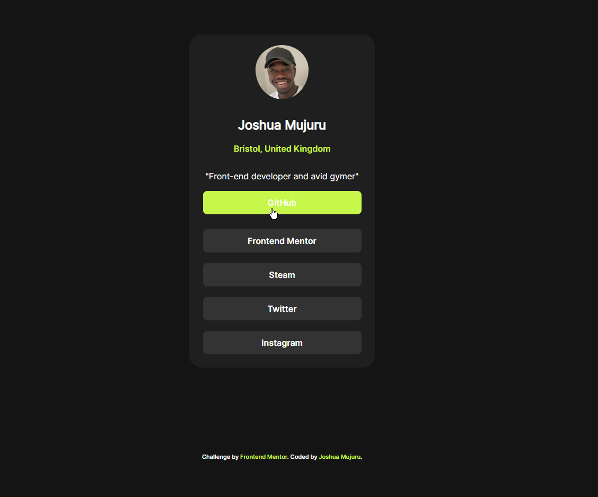
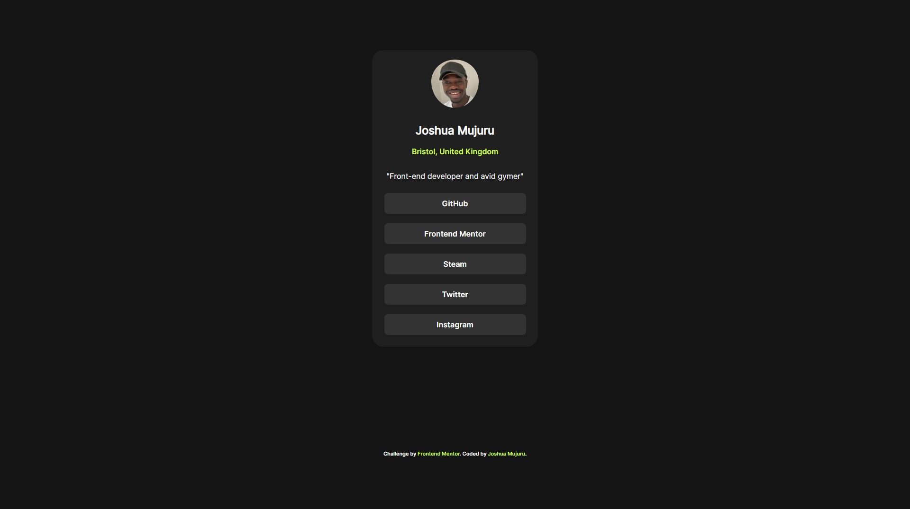
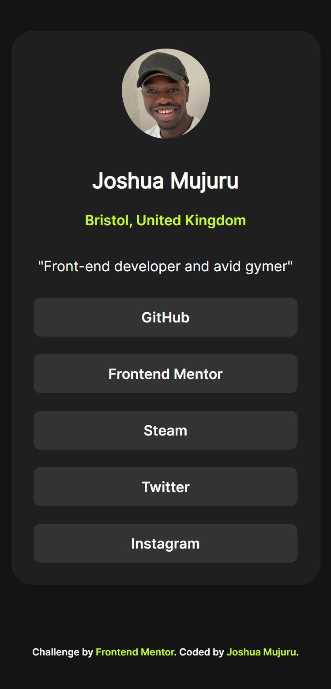

# Frontend Mentor - Social links profile solution

This is a solution to the [Social links profile challenge on Frontend Mentor](https://www.frontendmentor.io/challenges/social-links-profile-UG32l9m6dQ). Frontend Mentor challenges help you improve your coding skills by building realistic projects. 

## Table of contents

- [Overview](#overview)
  - [The challenge](#the-challenge)
  - [Screenshot](#screenshot)
  - [Links](#links)
- [My process](#my-process)
  - [Built with](#built-with)
  - [What I learned](#what-i-learned)
  - [Continued development](#continued-development)
- [Author](#author)

**Note: Delete this note and update the table of contents based on what sections you keep.**

## Overview

### The challenge

Users should be able to:

- See hover and focus states for all interactive elements on the page

### Screenshot

Active view

Desktop View

Mobile View

### Links

- Solution URL: [HTML & CSS code](https://github.com/JMujuru00/Social-Links-For-Profile/blob/main/index.html)
- Live Site URL: [Live Site](https://jmujuru00.github.io/Social-Links-For-Profile/)

## My process

### Built with

- Semantic HTML5 markup
- CSS
- Flexbox
- Mobile-first workflow

### What I learned

Creating this profile card with HTML and CSS was a rewarding experience that improved my understanding of web design basics. I learned how to organize content well using semantic HTML elements like <header>, <section>, and <footer>. This not only made the site more accessible but also made the code easier to manage. Styling the card with CSS, including rounded corners, a dark theme, and hover effects on social links, showed me the importance of using properties like border-radius, linear-gradient, and transition to make it look better and more interactive. Adjusting the layout to center the card and ensure it works on different screen sizes also gave me hands-on experience with margins, padding and flexbox.

This project also helped me improve my skills in color theory and typography by matching the design to the provided image, using a dark background with bright text colors like lime green for emphasis. I learned how to use pseudo-classes like :hover to create engaging user experiences and how to optimize image display with border-radius: 50% for circular avatars. Solving problems, such as aligning elements correctly and keeping consistent spacing, improved my problem-solving skills and attention to detail. Overall, this exercise increased my confidence in building custom, attractive components from scratch using HTML and CSS.

### Continued development

To continue my development after creating the profile card, I am focusing on improving my skills in several key areas. I am diving deeper into responsive design by mastering media queries and flexible layouts using tools like flexbox and grid to ensure my projects adapt smoothly across devices, from mobiles to tablets. I am exploring advanced CSS techniques, including animations with @keyframes and transform, advanced selectors, and CSS variables, to create more dynamic and reusable styles.

## Author

- Website - [Joshua Mujuru](https://github.com/JMujuru00)
- Frontend Mentor - [@JMujuru00](https://www.frontendmentor.io/profile/yourusername)
